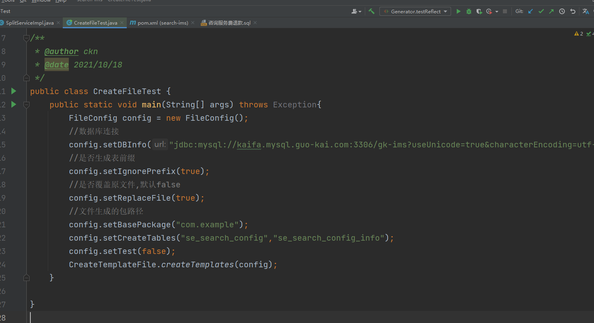
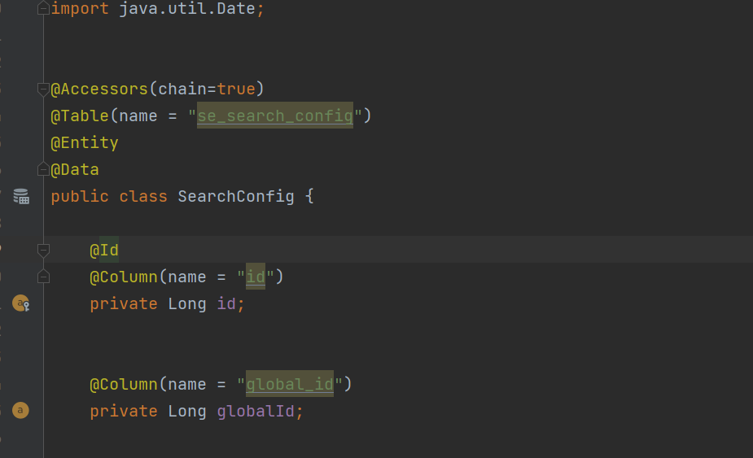
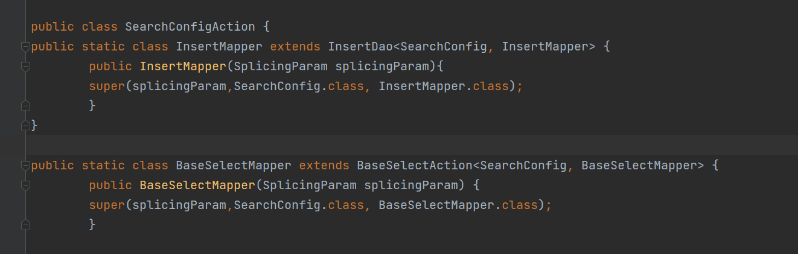
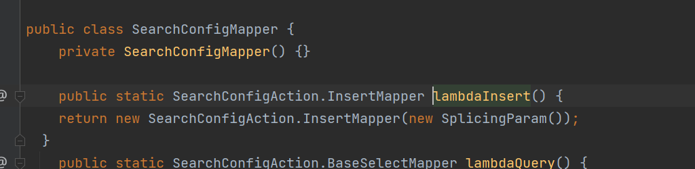
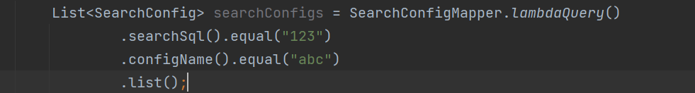
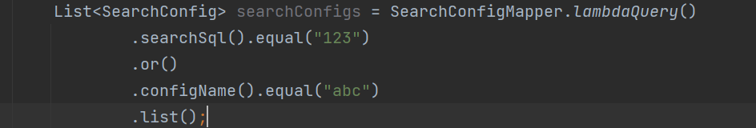
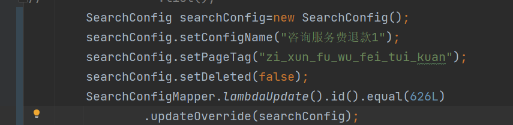
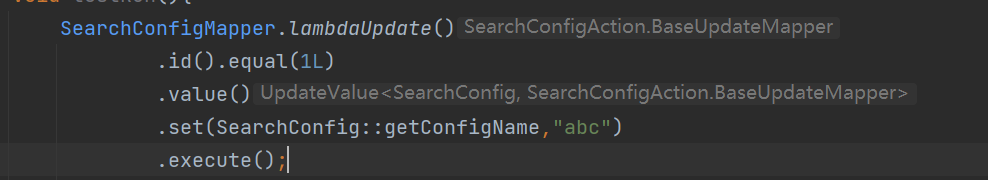
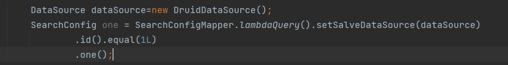
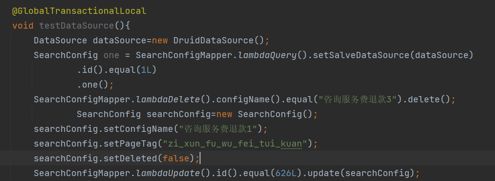

#软件定位
用于辅助后端处理数据库数据即基础的CRUD操作
#使用方式(maven方式)
     <dependency>
            <groupId>cn.ft.ckn</groupId>
            <artifactId>fast-mapper</artifactId>
            <version>1.0.0-SNAPSHOT</version>
        </dependency>
#使用环境
JDK1.7+
#简要使用说明
基础目录结构如下

生成操作文件如下:

其中dbInfo为基本的数据库连接信息
basePackage:基础包路径,根据自己项目中实际的修改即可
生成文件总共三个:
1.基础bean

2.action文件

3.dao文件

基础配置信息
#控制数据库操作日志输出
FastMapperConfig.isOpenSQLPrint=true;
#设置逻辑删除字段
FastMapperConfig.setDeleted(true,"deleted",false,true);
#设置更新时间字段
FastMapperConfig.setTimeColumn("create_time","update_time");
FastMapperConfig.setTimeAuto(true,true);
#查询
查询单条数据

查询多条数据

多条件查询and

多条件or关系

查询分页

#更新--插入

#更新--删除

#更新

单独某一值更新

#跨数据源查询

setSalveDataSource(dataSource)在多种操作模式lambdaQuery,lambdaDelete,lambdaInsert,
lambdaUpdate都可执行
#跨数据源全局事务--基于本操作框架的数据库操作

只需方法头添加@GlobalTransactionalLocal注解即可保证事务一致性