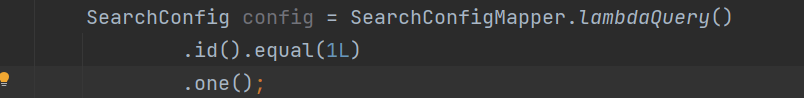
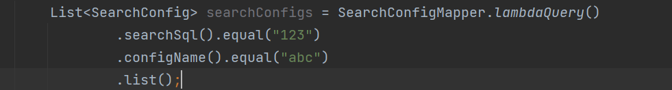
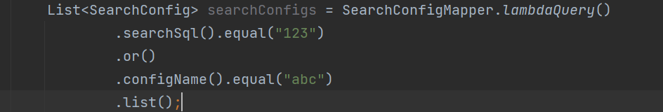
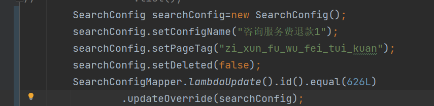
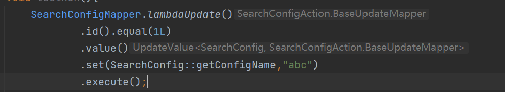
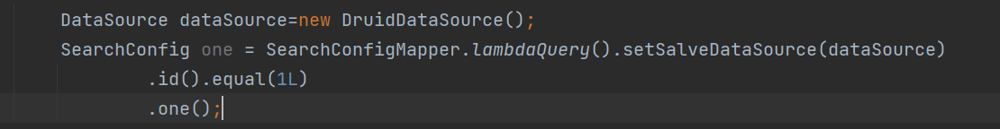
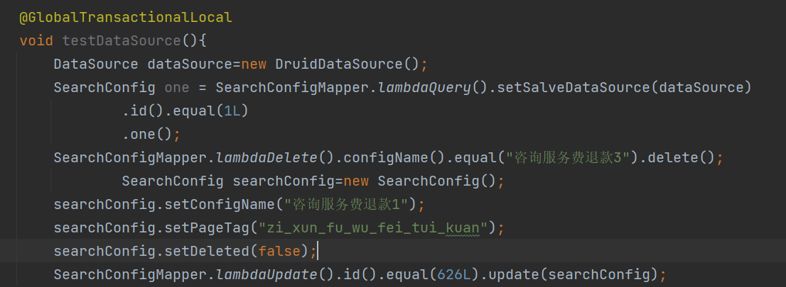

# 软件定位
用于辅助后端处理数据库数据即基础的CRUD操作
# 使用方式(maven方式)
```
     <dependency>
            <groupId>cn.ft.ckn</groupId>
            <artifactId>fast-mapper</artifactId>
            <version>2.0.0</version>
     </dependency>
```
# 使用环境
JDK1.8+
# 简要使用说明
基础目录结构如下


生成操作文件如下:
```
public class GenerateTest {
    public static void main(String[] args) {
        GenerateTemplateConfig config=new GenerateTemplateConfig();
        //基础目录
        config.setBasePackage("pers.ckn.sp");
        //无子模块项目则不无需填写
        config.setChildModuleName("");
        //数据库信息
        config.setDBInfo("jdbc:mysql://localhost:3306/user?useUnicode=true&characterEncoding=utf-8&serverTimezone=Asia/Shanghai&useInformationSchema=true",
                "root","123456","com.mysql.jdbc.Driver");
        //生成的表集合
        config.setCreateTables("user_info");
        //是否生成在test目录下
        config.setTest(false);
        //开始生成
        GenerateTemplate.generate(config);
    }
}
```
基础配置信息
## 项目配置信息
```
@Component
public class SearchConfig {
    static {
        //sql执行情况打印
        FastMapperConfig.isOpenSQLPrint = true;
        FastMapperConfig.addMapperExpander(SqlActuatorAspect.class);
        //自定义逻辑删除，插入更新时间定义
        FastMapperConfig.setDeleted(true,"deleted",false,true);
        FastMapperConfig.setTimeAuto(true,true);
        FastMapperConfig.setTimeColumn("create_time","update_time");
        FastMapperConfig.addMapperExpander(CustomActuatorAspect.class);
        //全局事务支持
        FastMapperConfig.addMapperExpander(TransactionActuatorAspect.class);
    }
}
```
## 查询

## 查询单条数据



## 查询多条数据

## 

## 多条件查询and

## 

## 多条件or关系

## 

## 查询分页

## 

## 更新--插入


## 更新--删除


## 更新



## 单独某一值更新



## 跨数据源查询



setSalveDataSource在多种操作模式lambdaQuery,lambdaDelete,lambdaInsert,
lambdaUpdate都可执行
## 跨数据源全局事务--基于本操作框架的数据库操作



只需方法头添加@GlobalTransactionalLocal注解即可保证事务一致性